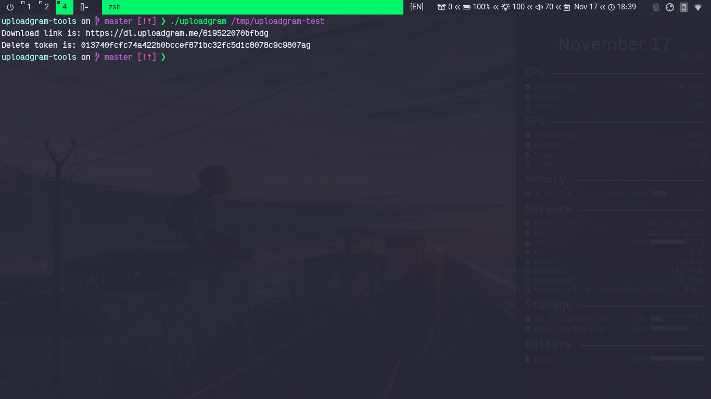
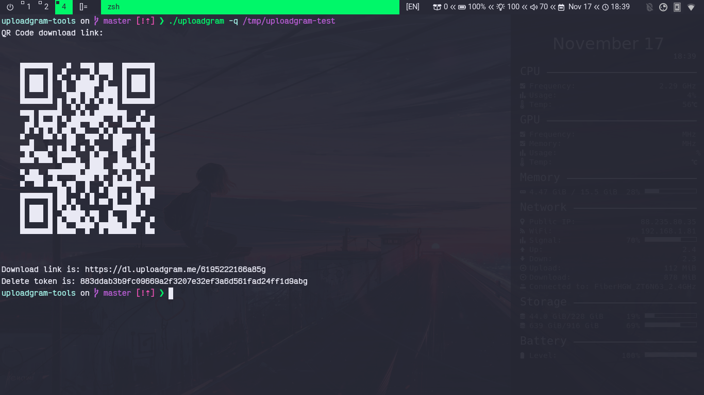
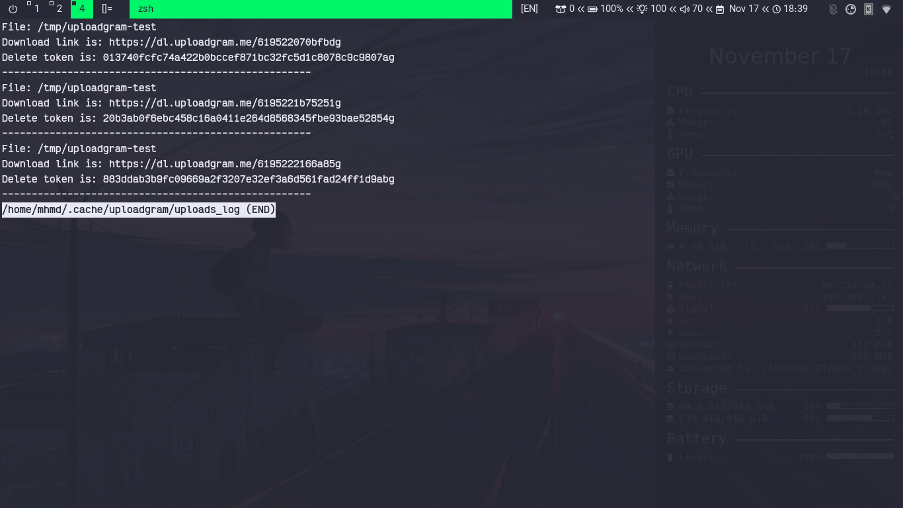

# uploadgram-tools
Simple tool to upload files to [uploadgram](https://uploadgram.me/) from terminal

List of dependencies:
 - curl
 - wc/du, awk
 - jq
 - libnotify
 - xclip
 - qrencode

## Caution
This script is just a simple tool to upload your files and it **does not** encrypt your data, so please do not upload your sensitive data or at least encrypt them.

## How to get it 
Place this script where you keep your scripts or run one of the following command:
```bash
# using curl
curl -s https://raw.githubusercontent.com/mrbooshehri/uploadgram-tools/master/uploadgram > /usr/local/bin/uploadgram

# using wget 
wget -qcO /usr/local/bin https://raw.githubusercontent.com/mrbooshehri/uploadgram-tools/master/uploadgram > /usr/local/bin/uploadgram
```
## How to use it
```bash
uploadgram [Options] <PATH_TO_YOUR_FILE>
```
## Options
```
  -h		Show this message
  -c		Copy download url to the clipbaord
  -q		Generate qr-code of download link
  -l		Show log of uploaded files
  -v		Show version
```
## Screenshots
- Upload
		
- Upload with qr-code
		 

	Exported png under ```~/Pictures/uploadgram-qr```
 
		
- Log
		

## Contributing
Pull requests are welcome, just fork the project made your changes and submit your request or open an issue for your request.
